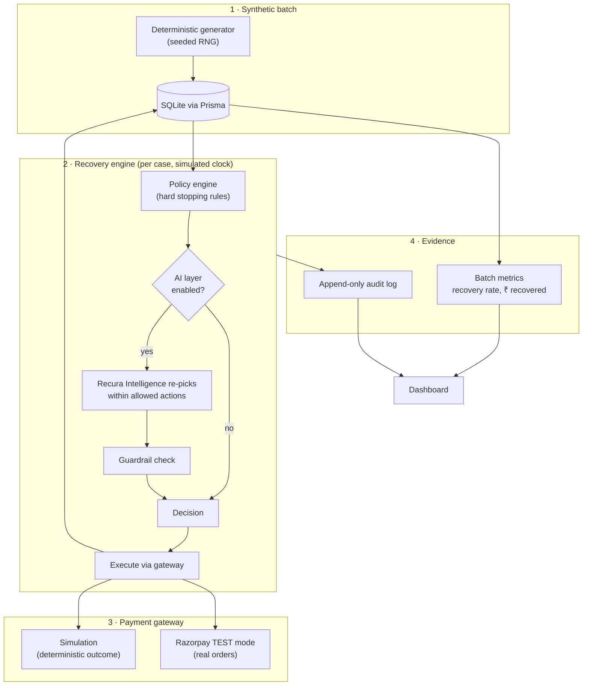

# Recura — AI Revenue Recovery

**A controlled AI agent that recovers failed subscription payments — with hard stopping rules, a full audit trail, and honest batch metrics.**

Recura takes a batch of failed recurring charges (the kind every subscription business silently loses to *involuntary churn*), and works each one like a careful ops analyst: it classifies **why** the payment failed, picks the right recovery move, retries against the payment gateway, and **stops cleanly** the moment continuing would be pointless or abusive. Every decision is logged so a reviewer can trace any single case from failure to outcome.

> Built for **Track 3: AI Revenue Recovery**. Payment execution runs against **Razorpay test mode** (or a deterministic built-in simulator); the recovery *decisions* are the product.

---

## The headline (seed `42`, 80-customer batch — reproducible)

| Metric | Result |
| --- | --- |
| Failed payments processed | **80** (₹51,820 at risk) |
| Recovered (by count) | **54 / 80 → 67.5%** |
| Recovered (by value) | **₹39,628.20 → 76.5%** |
| **Stopped cleanly** (no over-dunning) | **26** (7 hit the attempt cap, 19 halted before any retry) |
| Avg attempts to recover | **1.8** |
| Saved via win-back discount | 11 cases (₹2,217.80 in discounts given up to retain recurring revenue) |

Two things make these numbers trustworthy:

1. **They come from a whole batch, not a cherry-picked demo.** Re-run the batch and you get the same figures, every time (deterministic seed).
2. **Value-recovery (75.1%) is higher than count-recovery (65.0%) *on purpose*.** The agent chases the ₹2,999 subscriptions and walks away from ₹49 add-ons and cancelled customers. It optimizes for money saved, not a vanity success rate.

---

## Why this isn't "a bot that retries forever"

The scary version of a payment-recovery agent hammers a customer's card 20 times and gets the merchant's account flagged. Recura is the opposite — the **stopping rules are first-class and visible** (see the **Policy** page in the app):

- **Max 3 attempts per case.** Then the case is `exhausted` and closed. Full stop.
- **No dunning after cancellation.** If the customer already left, recovery halts before the first retry.
- **Minimum recoverable amount (₹50).** Below this, a retry costs more in fees/goodwill than it can recover, so the case is abandoned cleanly.
- **Backoff between attempts** (0h → 72h → 120h for funds failures; shorter for transient network errors) so we wait for payday instead of re-charging a dry account.
- **Never retry a dead instrument.** Expired/blocked cards go straight to "update your payment method" — retrying them is guaranteed to fail.
- **Win-back discounts are tightly gated** — high-LTV `core`/`vip` customers only, once per case, on the final attempt.

These rules are enforced by a **deterministic policy engine** and are **unit-tested** (`src/tests/policy.test.ts`, 16 tests). The local Recura Intelligence layer can only *re-pick within the actions the policy already allows* — it can never exceed the cap, dun a cancelled customer, or override a hard stop. If the intelligence layer proposes something disallowed, the system falls back to the rules decision **and records the override in the audit trail.**

---

## Architecture



The **single source of truth** for "how likely is this action to succeed" ([`successProbability()`](src/lib/failure-reasons.ts)) is used by *both* the agent's stated confidence *and* the simulator's actual outcome draw — so the confidence a reviewer sees is honest, not decorative.

Full write-up in [docs/ARCHITECTURE.md](docs/ARCHITECTURE.md). Pitch script in [docs/PITCH.md](docs/PITCH.md).

---

## What's real vs. simulated

Being explicit here, because it matters for a payments track:

| Piece | Status |
| --- | --- |
| Recovery **decision logic** & stopping rules | **Real.** Deterministic policy engine, fully unit-tested. |
| **Recura Recovery Intelligence** reasoning | **Real & Local.** Built-in local intelligence engine computing deterministic recovery scores (0-100), classifications, and factors without external API dependencies. |
| Razorpay **order creation** | **Real** against Razorpay TEST mode when `RAZORPAY_MODE=live` + keys are set — actual API calls to `api.razorpay.com`. |
| Whether a retried charge ultimately **succeeds** | **Simulated** from the probability model. You can't script a real card to "fail twice then succeed on payday" in a hackathon, so the *outcome* is modeled — transparently, from one source of truth. |
| Customer batch (names, plans, failure reasons) | **Synthetic**, deterministically generated. |
| Audit trail, metrics, dashboard | **Real** — computed from the actual database rows the engine wrote. |

Out of the box it runs **100% offline** on the simulator with zero external keys.

---

## Quickstart

Requires Node 18+.

```bash
npm install
npm run setup      # generate Prisma client, push schema, seed the batch
npm run dev        # http://localhost:3000
```

Then in the dashboard: **Run recovery batch** or **Run with AI** → explore the funnel, the per-case traces, the audit log, and the **Policy** page.

To reset and reproduce from scratch at any time:

```bash
npm run seed       # re-seed the deterministic batch
```

Run the test suite:

```bash
npm run test
```

### Optional: turn on real Razorpay integration

In your `.env`:

```bash
# Enable live Razorpay TEST-mode order creation
RAZORPAY_MODE="live"
RAZORPAY_KEY_ID="rzp_test_xxxxxxxx"
RAZORPAY_KEY_SECRET="xxxxxxxx"
RAZORPAY_WEBHOOK_SECRET="whsec_xxxxxxxx"
```

Then run the end-to-end test flow:

```bash
npm run dev
npm run razorpay:test
```

This script:

1. Creates a real Razorpay test plan in TEST mode.
2. Creates synthetic test subscriptions for a small batch.
3. Triggers a `payment.failed` webhook to the local app.
4. Verifies the webhook signature and records the receipt in the audit trail.

This is the exact manual validation path for the steps you described: key setup → test plan → synthetic customer batch → failed charge → webhook observation.

---

## Environment variables

| Var | Default | Purpose |
| --- | --- | --- |
| `DATABASE_URL` | `file:./dev.db` | PostgreSQL / SQLite database connection URL. |
| `RECURA_SEED` | `42` | Deterministic batch seed — the knob for reproducibility. |
| `RAZORPAY_MODE` | `simulation` | `simulation` or `live` (Razorpay TEST mode). |
| `RAZORPAY_KEY_ID` / `_SECRET` | — | Razorpay TEST keys (live mode only). |
| `RAZORPAY_WEBHOOK_SECRET` | — | Verifies incoming webhook signatures. |

---

## Project structure

```
src/
  lib/
    failure-reasons.ts   # reason catalog + the single-source-of-truth probability model
    policy.ts            # the stopping rules + reason-specific playbook (deterministic)
    intelligence.ts      # local Recura Recovery Intelligence Engine (scoring, classification, factors)
    agent.ts             # policy + intelligence layer, with hard guardrails
    engine.ts            # per-case recovery loop with a simulated clock
    gateway/             # PaymentGateway interface: simulation + real Razorpay adapter
    metrics.ts           # batch metrics computed from DB rows
    seed-data.ts         # deterministic synthetic batch generator
    csv-import.ts        # RFC 4180 CSV parser, validator, and importer
  app/
    page.tsx             # Overview dashboard (funnel, charts, KPIs)
    cases/               # case list + end-to-end case trace
    import/              # custom CSV data import interface
    audit/               # append-only audit log
    policy/              # the visible stopping rules
    api/                 # seed / run / reset / metrics / cases / audit / webhook / import
  tests/                 # comprehensive Vitest test suite
```

## Tech stack

Next.js 15 (App Router) · React 19 · TypeScript · Prisma (PostgreSQL / SQLite) · Tailwind · Recharts · Vitest.

---

## License

MIT — built for a hackathon; use it however helps.
