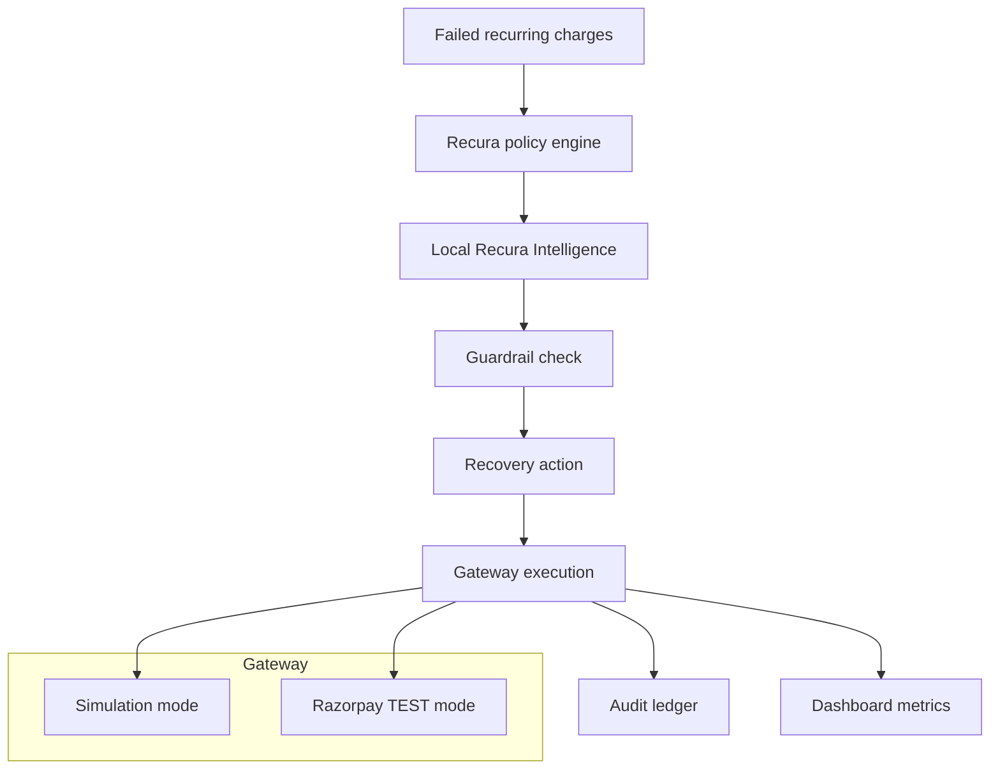

# Recura — AI Revenue Recovery

<p align="center">
  
  
  
  
  
</p>

<p align="center">
  <strong>Guardrailed recovery intelligence for failed recurring payments.</strong><br />
  Recura decides when recovery is worth it, chooses the right intervention, and knows when to stop.
</p>

Recura is built for a very specific problem: failed recurring payments create silent churn, and most businesses either retry too aggressively or give up too early. This app models a payment recovery operator that:

- classifies the failure reason
- scores the chance of recovery
- chooses the safest intervention
- applies policy guardrails before any retry
- records every decision in an immutable audit ledger

The result is a transparent, explainable recovery system designed for subscription operators, fintech teams, and Razorpay-style payment rails.

> Live demo: https://recura-three.vercel.app/
>
> GitHub: https://github.com/ashwin777-ctrl/recura

---

## Why this matters

Recurring payment failures are often treated as a pure tech issue, but the real business problem is customer churn. A retry that happens at the wrong time can damage trust, create fee overhead, and burn a valuable customer relationship. Recura flips that logic: it treats recovery as an operational decision problem, not a blind retry loop.

The product is designed around three principles:

1. Preserve revenue where recovery is likely to work
2. Stop before over-dunning or abusive retrying
3. Make every decision traceable and explainable

---

## What Recura does

- Evaluates failed payment cases from a batch or imported CSV
- Applies deterministic stop rules before any recovery action
- Uses a local intelligence layer to score recovery likelihood
- Chooses from actions like delayed retry, payment method update, or win-back discount
- Writes the entire decision and execution trail to the audit log
- Surfaces key metrics on the dashboard: value at risk, recovered value, stop rate, and attempt behavior

---

## Verified metrics

These numbers reflect the latest verified run in the repo and are the numbers to use in the pitch and README:

| Check | Result |
| --- | --- |
| Unit + integration tests | **43/43 passing** |
| E2E tests | **8/8 passing** |
| Type-check | **pass** |
| Production build | **pass** |
| Live app health | **healthy** |
| Database status | **connected to Supabase PostgreSQL** |

The app is also verified to work in simulation mode without any external API dependency, while remaining ready for live Razorpay TEST mode when valid credentials are present.

---

## Core architecture



### System highlights

- Deterministic policy engine enforces hard stopping rules
- Local intelligence scores risk and recommends the next move
- Gateway layer supports both simulation and real Razorpay TEST mode
- All outcomes and decisions are persisted as append-only audit events
- Data is visible in the dashboard, case detail, audit log, and policy page

---

## Project stack

- Next.js 15 (App Router)
- React 19 + TypeScript
- Tailwind CSS
- Prisma + PostgreSQL / SQLite
- Razorpay payment adapter
- Vitest + Playwright

---

## Quick start

Requires Node 18+.

```bash
npm install
npm run setup
npm run dev
```

Open http://localhost:3000 and use:

- Overview dashboard
- Run recovery batch
- Run with AI
- Recovery cases
- Policy rules
- Audit ledger
- CSV import
- Webhook sandbox

---

## Live Razorpay TEST mode

The app supports a real Razorpay TEST integration when valid credentials are configured.

1. Create or update a local `.env` file.
2. Set:

```bash
RAZORPAY_MODE="live"
RAZORPAY_KEY_ID="rzp_test_xxxxxxxx"
RAZORPAY_KEY_SECRET="xxxxxxxx"
RAZORPAY_WEBHOOK_SECRET="whsec_xxxxxxxx"
```

3. Run:

```bash
npm run razorpay:test
```

> Important: the repo intentionally keeps live mode off by default and stays fully functional in simulation mode without external keys.

---

## Environment variables

| Variable | Default | Purpose |
| --- | --- | --- |
| `DATABASE_URL` | local DB connection | app database |
| `RECURA_SEED` | `42` | deterministic batch seed |
| `RAZORPAY_MODE` | `simulation` | `simulation` or `live` |
| `RAZORPAY_KEY_ID` | empty | Razorpay TEST key id |
| `RAZORPAY_KEY_SECRET` | empty | Razorpay TEST secret |
| `RAZORPAY_WEBHOOK_SECRET` | empty | validates webhook HMAC |

---

## Why the app is credible

The app does not hide the hard tradeoff. It is designed around the principle that a recovery system should be transparent and safe:

- it recovers where value is clear
- it stops when the customer is no longer salvageable
- it avoids excessive retry loops
- it explains every intervention in a traceable way

This is what makes the product persuasive to operators, product stakeholders, and judges: the logic is visible, measurable, and governed by strict rules rather than guesswork.

---

## Repo structure

```text
src/
  app/
    page.tsx
    cases/
    import/
    audit/
    policy/
    sandbox/
    api/
  components/
  lib/
  tests/
prisma/
scripts/
README.md
docs/
```

---

## License

MIT

---

## Status

Ready for demo, audit, and buildathon review with live simulation validated and real Razorpay TEST mode available when credentials are supplied.

This update keeps the README polished enough for GitHub, but still honest about the live-mode requirement.
